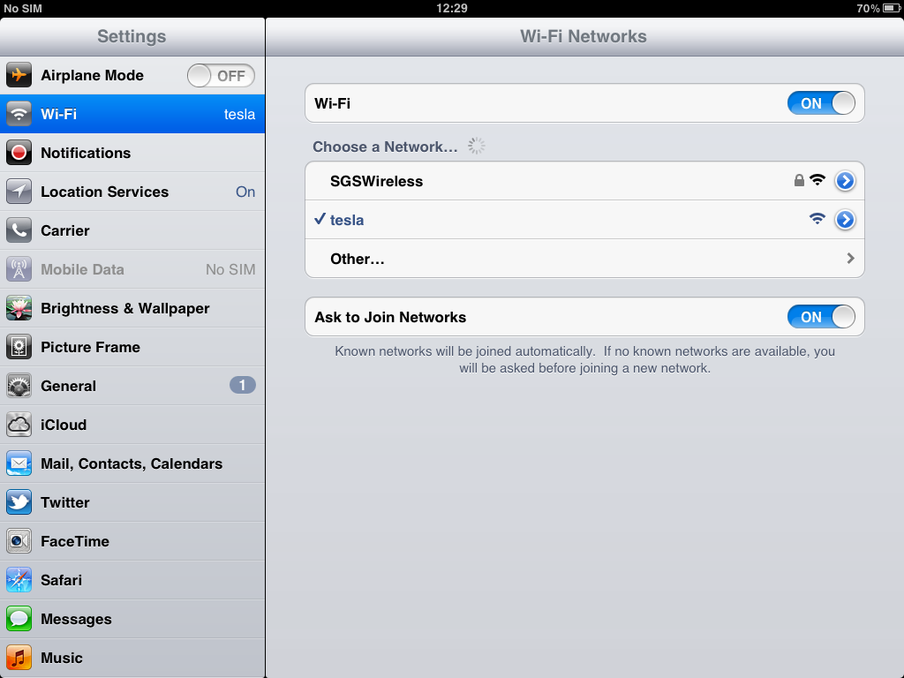
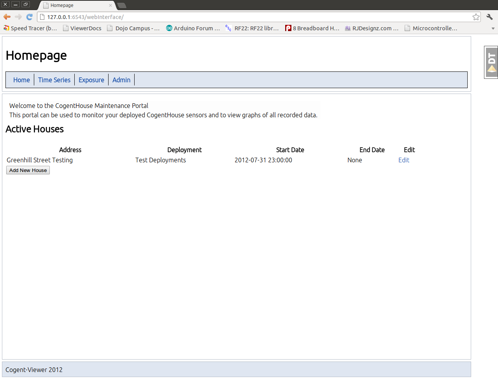
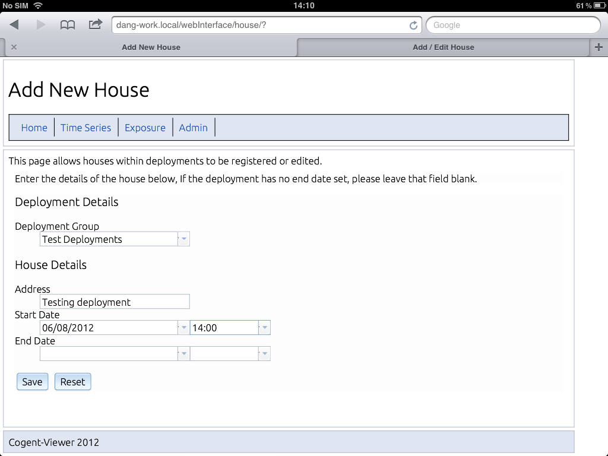
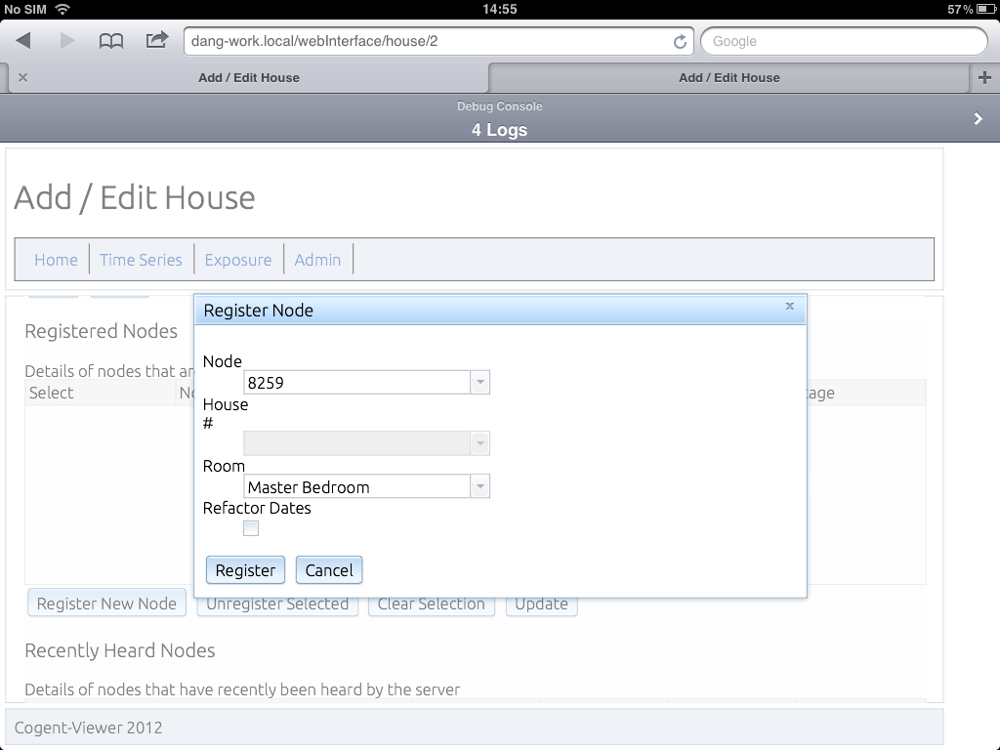
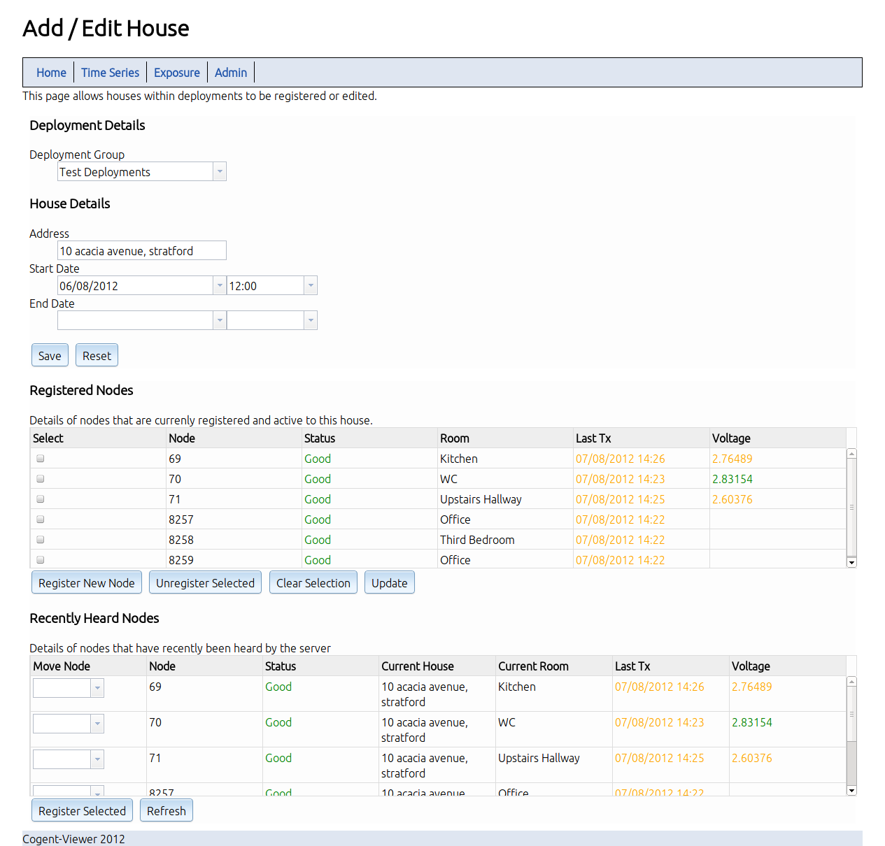

=================
Deployment Setup
=================

This section provides a guide to setting up and managing deployments.

Hardware Setup
===============

Setup the Server
------------------

#. Connect the server node to the server using the USB cable
#. Connect the server to the router, using the Ethernet cable
#. Connect the devices to the power supply.

Deploy the Nodes
------------------

Place a node in each room ensuring you make a note of where the nodes

Node Placement Tips
---------------------

Registering a new deployment
============================

Connect to the server
----------------------

Connect to the wireless network, the network name will generally be that of the server.
For example *GAUSS* or *EINSTEIN*.

To connect to a network on an Ipad, go to the setting page -> Wi-Fi and select
the appropriate network. The image below shows an example of connecting to the
*tesla* wireless network.

   Connecting to a wireless network.

Open the Server Administration Web Page
----------------------------------------

Open the server administration page.  The web address for this page will be
**<server>.local/webInterface/**

Examples of the web address for a given server are:

+-------------+-----------------------------+
| Server Name | URL                         |
+-------------+-----------------------------+
| gauss       | gauss.local/webInterface    |
+-------------+-----------------------------+
| einstein    | einstein.local/webInterface |
+-------------+-----------------------------+
| euler       | euler.local/webInterface    |
+-------------+-----------------------------+

The web interface should display the following page.

   Connecting to the Homepage 

To register a new house, click the **add new house** button 

.. note::

   If there are active deployments that have finished, you can use the edit
   function to close the deployment.

This should bring the **add house** page

Add a new house
----------------

Complete / Edit the details of the new house and click save

* The deploymnent group is a logical grouping of deployments (ie Winter 2011)
* Start and End data correspond to when the nodes were deployed at this location
  If the house has no pre-aranged end date, this field can be left blank.

   Registering a new house at 10 acacia avenue.

Register Deployment Nodes
--------------------------

Selecting Save should refresh the page with the following additional information

.. figure:: images/registerNodes.png
   :width: 640px

   Registering new nodes to a house

* **Registered Nodes** are those currently active within a deployment
* **Recently Heard Nodes** are those that the have transmitted data to the
    server recently, along with information on their current deployment location

.. note:: 

   A Node can only be active in one house at any one time.  If a node is missing
    from the registered nodes list you can use the recently heard nodes list to
    double check that is registered to the current property.

You now have two options to register nodes within a deployment.

Registering Individual Nodes
^^^^^^^^^^^^^^^^^^^^^^^^^^^^^

Click the **Register New Node** button.  This will display the following dialog:

   
   Registering an indivudual node.

The options are as follows:

Node

    Select the Node ID you want to register from the drop-down list.  The Node ID is the
    final number on the nodes label.  For example, the node with label
    **2-5-0-69** has node id **69** If the node is not in the list, you can
    *pre-register* a node with the system by entering a new nodeId.  This is
    useful in situations where a node has not yet communicated with the server.

Room

    Select the room the node is located in from the drop-down list. If the room
    is not in the list, you can enter a new room type here.

Refactor Dates 

    This checkbox is an advances option that can be used when the
    deployment has been running for a period of time before nodes have been
    registered. When selected it registered all readings from this node between
    the deployment start and end dates to the given room.

.. note::

   When Registering new rooms, make use of generic descriptions (For example
   Second Bedroom) This allows similar rooms to be compared across deployments.
	
.. warning::

   Be careful when using the *refactor dates* checkbox, as it will re-register
   all readings between the house start and end date to the room within the
   house. This can cause readings for one property to be assigned to another home.

Registering Multiple Nodes at the Same time
^^^^^^^^^^^^^^^^^^^^^^^^^^^^^^^^^^^^^^^^^^^^^

Most of the time, a deployment will involve moving a full set of nodes between houses.
In this case, the *recently heard nodes* list allows us to register multiple nodes at the same time.

For each node you wish to register in a new location, modify the *Move Node* dropdown box, then click the Register Selected button.
This will re-register those nodes to these locations within the current house.

.. figure:: images/registerNodes.png
   :width: 600px
   
   Registering Multiple Nodes

Checking Node Status
======================

The registered nodes screen also gives an overview of the current node status, 
Before leaving a deployment, check that all nodes have a *GOOD* status, and sufficent battery voltage.

It is recommended that the batteries are changed when they reach 2.4 volts.

   Checking node status.
   

